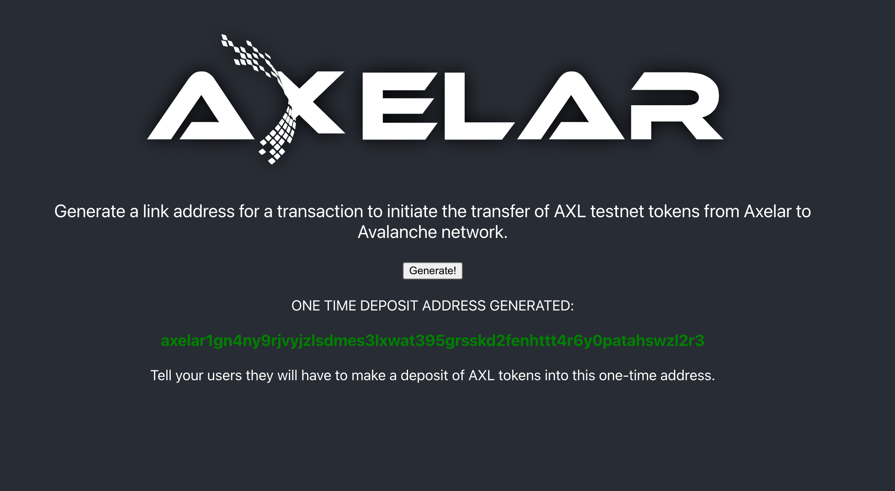

# Deposit address demo

This simple frontend demo app uses [axelarjs-sdk](https://github.com/axelarnetwork/axelarjs-sdk) to enable a user to transfer AXL tokens from Axelar to Avalanche.

This demo performs one task: call `getDepositAddress` to request a one-time deposit address `A` from the Axelar network and present `A` to the user. (From here, the user may send AXL tokens to `A` on the Axelar blockchain. Any user who does this will soon see wrapped Axelar tokens appear in her Avalanche wallet.)

# Developer notes

Refer to [axelarjs-sdk](https://github.com/axelarnetwork/axelarjs-sdk) for code snippets on SDK setup, instantiation, and invocation.

# What the user sees

## Prerequisites

Configure your Metamask as per [Set up Metamask for EVM chains | Axelar Docs](https://docs.axelar.dev/roles/user/metamask):

- Add Avalanche testnet to your "networks"
- Import the Axlear ERC20 token to your "assets" for Avalanche

## Run the demo

Clone this repo, install axelarjs-sdk, and run the server

```bash
git clone git@github.com:axelarnetwork/sdk-demo-v5-deposit-address.git
cd sdk-demo-v5-deposit-address
npm install
npm start
```

Click the text "Click here to generate a link address..." in the demo. Metamask will appear again, asking you to sign a one-time code.

After a few seconds you should see the following



The demo is now complete.

## Optional: transfer AXL tokens to Avalanche

Send AXL testnet tokens to the one-time deposit address `axelar1...`. One way to do this is visit [Axelar Testnet Faucet](https://faucet.testnet.axelar.dev/).

Check the balance of your one-time deposit address at [Axelarscan testnet explorer](https://testnet.axelarscan.io/)

The Axelar network microservices will automatically transfer AXL tokens from your one-time address to your Metamask Avalanche testnet account.

Wait a few minutes. Then check the "Axelar (AXL)" ERC20 token balance of your Metamask Avalanche testnet account at [SnowTrace: Avalanche Testnet C-Chain Blockchain Explorer](https://testnet.snowtrace.io/)
